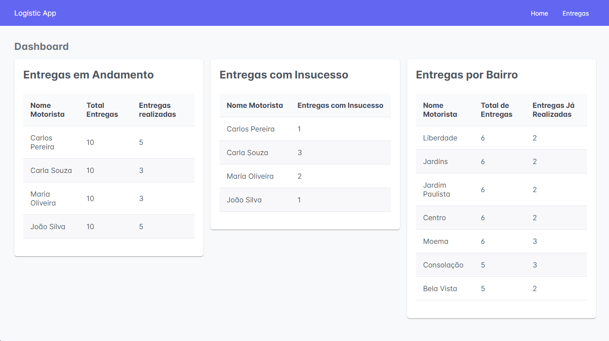
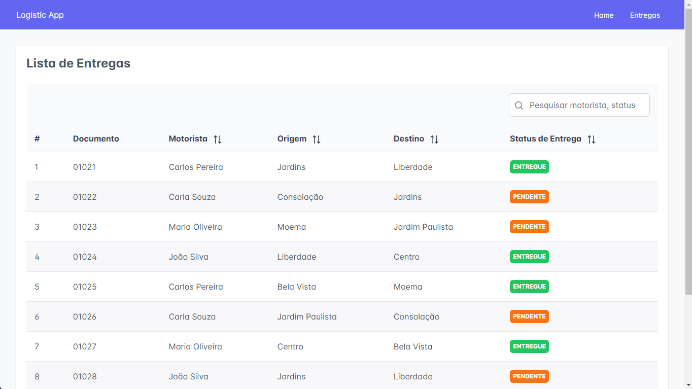

# Logistica App

[](https://deepscan.io/dashboard#view=project&tid=20752&pid=27610&bid=884464)


Projeto: Desafio Front-end - Logística com gerenciamento de transport
Objetivo: Este projeto é uma solução para o desafio de desenvolvimento front-end focado em logística e gerenciamento de transporte. O objetivo principal é criar uma interface intuitiva e eficiente que permita aos usuários acompanhar as entregas de uma transportadora de maneira fácil e confiável.

Visite o projeto aqui: [Movie Catalog](https://logistica-com-gerenciamento-de-transporte.vercel.app/dashboard)

## Branches
- [main](https://github.com/ricardobelfort/logistica-com-gerenciamento-de-transporte/tree/main): contém as últimas alterações de código

## Tecnologias

Este projeto utiliza as seguintes tecnologias:

- Framework Front-end: Angular
- Gerenciamento de Estado: RxJS
- Estilização: CSS / PrimeNG / PrimeFlex
- Comunicação com Back-end: Fetch API do Angular

## Screenshots

Página principal de dashboard:

<p align="center">
  
</p>

Página principal com a lista de entregas:

<p align="center">
  
</p>

## Rodando o projeto localmente

É necessário ter o Node.js / NPM instalados localmente.

1. Instale todas as dependências necessárias:

```
npm install
```

2. Execute o projeto:

```
npm run start
```

Abra seu navegador e acesse **http://localhost:4200** (porta padrão do Angular).

3. Executando testes unitários

```
ng test
```

## Sobre

Este projeto foi gerado com [Angular CLI](https://github.com/angular/angular-cli) version 17.3.7.
